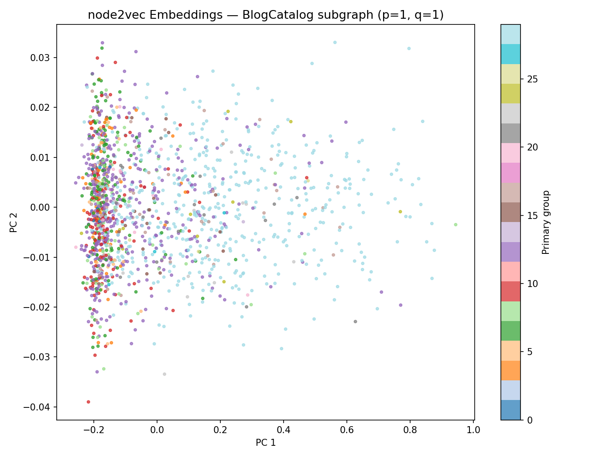

# 📌 Node2Vec Data Mining Project

## 📖 Overview
This project implements the **node2vec algorithm** to learn low-dimensional node embeddings from graph data. These embeddings capture structural relationships between nodes and are evaluated using a **node classification task** on the BlogCatalog dataset.

---

## 📊 Dataset
- **Dataset:** BlogCatalog social network  
- **Full Graph:** 88,784 nodes, 2,093,195 edges  
- **Subgraph Used:** 1,500 nodes, 18,761 edges  
- **Task:** Multi-label node classification  
- **Number of Labels:** 40,604 groups  

📎 Dataset source:  
https://datasets.syr.edu/datasets/BlogCatalog3.html

---

## ⚙️ Installation

Install required dependencies:

```bash
pip install -r requirements.txt
```

## ▶️ How to Run

1. Navigate to the `code/` folder  
2. Open `node2vec.ipynb`  
3. Run all cells in order  

---

## 📈 Results

### Performance Metrics

| p    | q    | Micro-F1 | Macro-F1 |
|------|------|----------|----------|
| 1.00 | 1.00 | 0.0435   | 0.0003   |
| 0.25 | 4.00 | 0.0444   | 0.0003   |
| 4.00 | 0.25 | 0.0419   | 0.0003   |

---

## ⏱️ Runtime

- **Embedding time:** ~7–10 seconds  
- **Total runtime:** ~170 seconds  

---

## 📷 Visualization

PCA projection of learned node embeddings:



---

## 🧠 Methodology

The **node2vec algorithm** generates node embeddings using **biased random walks**, which are treated similarly to sentences in natural language processing.

These walks are used to train a **skip-gram model**, allowing nodes with similar structural roles to have similar embeddings.

### Key Parameters:
- **p (return parameter):** Controls likelihood of revisiting a node  
- **q (in-out parameter):** Controls exploration (BFS vs DFS behavior)  

---

## 📌 Key Takeaways

- node2vec successfully captures structural information from graph data  
- PCA visualization shows partial clustering of node groups  
- Performance is limited due to:
  - Extremely large label space (40k+ labels)  
  - Sparse multi-label classification setting  
- Parameter tuning (p, q) affects embedding quality  

---

## ⚠️ Limitations

- Sensitive to hyperparameter tuning  
- Computational cost increases with graph size  
- Does not incorporate node features  

---

## 🚀 Future Improvements

- Apply Graph Neural Networks (GNNs)  
- Incorporate node attributes/features  
- Improve classification model  
- Optimize random walk sampling  

---

## 👩‍💻 Authors

- **Elizabeth Casey**
- **Maddie Larkin**
